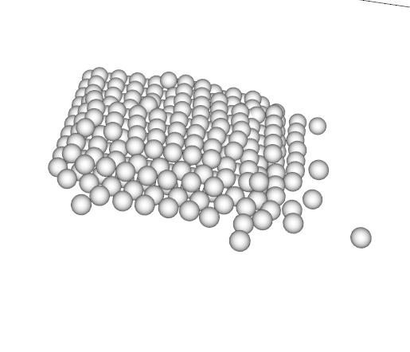

# INF585 - POSITION BASED DYNAMICS

This repository containt implemention of Unified Particle Physics for Real-Time Applications ([Muller et al.](https://mmacklin.com/uppfrta_preprint.pdf)) based on Position Based Dynamics simulator. I provide several test to explore the capacity of the system to simulate physics and different kind of object. 

## Dependancies
* Eigen

## Setup (Linux)

This step create the build directory, call CMake to generate the Makefile, compile and execute the code. Note that the creation of the build directory and CMake call has to be done only once on a given system.

The following command assume you have opened a command line in the directory Position-Based-Dynamics/

```Shell
$ ./compile.sh && ./run.sh
```

# Test

In the file `scene/current_scene.hpp` you can choose the test you want to run between:

* **Rigid Body + Friction**: In this test we show how we simulate rigid body. We set up three rigid body with different friction coefficient to see how it slow down their move.

* **Cloth**: Our simulator can simulate cloth and wind. Cloth self-collision and inter-collision with other cloth pieces is
handled automatically by the particle collision pipeline

* **Fluid**: We use SPH to estimate fluid particule density. This allow use to simulate fluid

* **Collision Grid debug**: This show is our collision grid system. We use this visualization for debug to see if everything work well.

| Test | Images  | 
|-----------------------|:-----------------------------|
| Rigid Body |      |
| Cloth |      |
| Granular |      |
| Granular |      |

